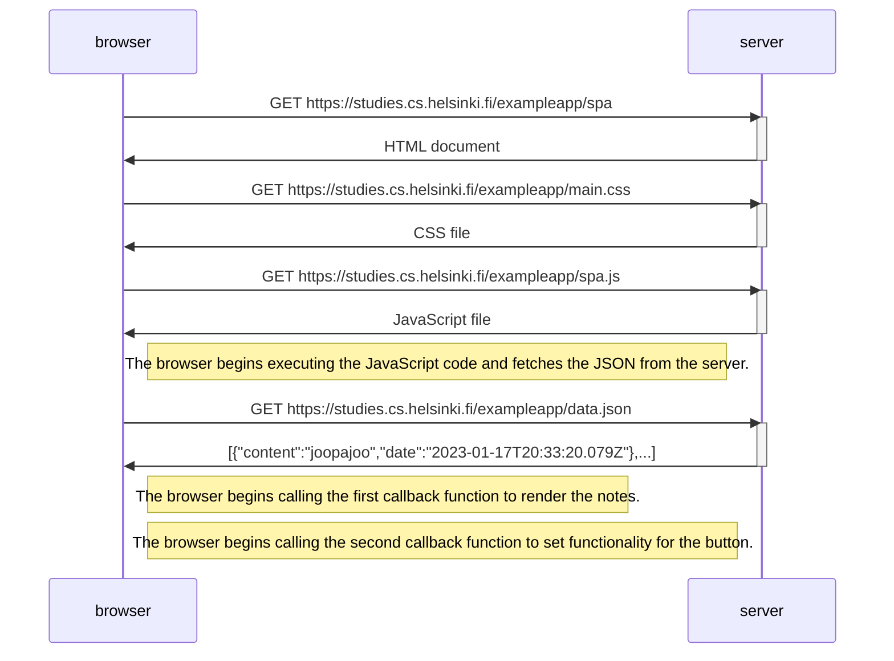

```mermaid
sequenceDiagram;
    participant browser;
    participant server;

    browser->>server: GET https://studies.cs.helsinki.fi/exampleapp/spa;
    activate server;
    server->>browser: HTML document;
    deactivate server;

    browser->>server: GET https://studies.cs.helsinki.fi/exampleapp/main.css;
    activate server;
    server->>browser: CSS file;
    deactivate server;

    browser->>server: GET https://studies.cs.helsinki.fi/exampleapp/spa.js;
    activate server;
    server->>browser: JavaScript file;
    deactivate server;

    Note right of browser: The browser begins executing the JavaScript code and fetches the JSON from the server.;

    browser->>server: GET https://studies.cs.helsinki.fi/exampleapp/data.json;
    activate server;
    server->>browser: [{"content":"joopajoo","date":"2023-01-17T20:33:20.079Z"},...];
    deactivate server;

    Note right of browser: The browser begins calling the first callback function to render the notes.;
    Note right of browser: The browser begins calling the second callback function to set functionality for the button.;
```